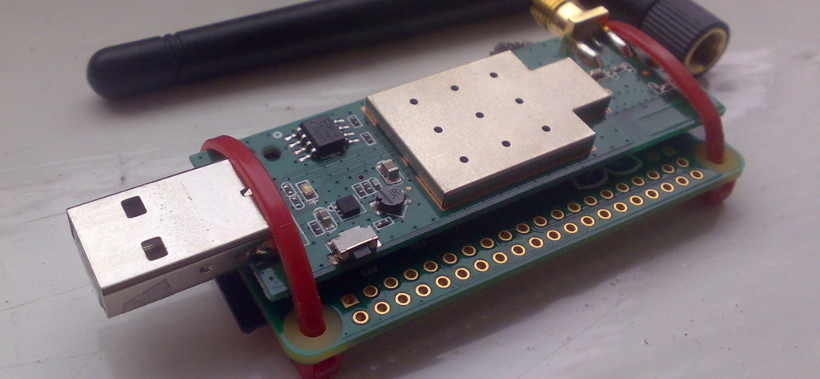
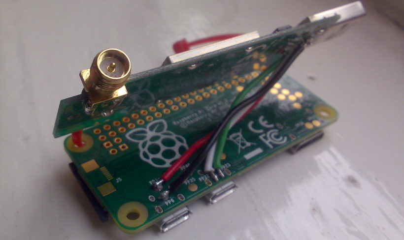

I recently stumbled across the Pirate Box project and instantly loved the idea. Put simply it's a wifi based file
 sharing platform that's completely disconnected from the internet. The only way to access or upload files from a pirate
 box is to be physically within range of the it's access point.

Once I saw that it had an SD card image for the Raspberry Pi I naturally wanted to build my own but also wanted to do
 something a little different...

<!-- more -->

There are plenty of Raspberry Pi based Pirate Boxes out there but I wanted to build something portable, low profile,
 without lots of wires and low power. The Pi zero was the obvious choice.

## Wireless

As I didn't have a Pi Zero W, which has built in WiFi, I needed an AP capable USB WiFi adapter. There is a list of known
 capable adapters on the [Pirate Box site](https://piratebox.cc/raspberry_pi:piratebox_wifi_compatibility).

I used a TP Link WN722N partly as I had one to hand but mainly because it is the same length but not as wide as the Pi
 Zero. This left all the GPIO pins accessible for further expansion and hackery.

I wanted to avoid connecting the WiFi adapter using a cable as the USB connector on the Pi Zero is on the side and
 would've been messy to do even with a very small USB micro cable. Instead I opted to solder 4 small wires from the WiFi
 adapter USB connector to the USB breakout pads on the underside of the Pi, this connected both data and power between
 the two.

## Power

The Pi Zero is typically powered via a micro USB connector on one edge of the board but I didn't want to go down this
 route as again a connector sticking out of the side would've greatly increased the size of the device. Instead I used
 provided power into the USB connector on the WiFi adapter.

This works to power the Pi and WiFi adapter because the 5v rail is shared between everything that is connected.

This did cause one slight issue though as when I plugged this into a PC it recognised and started talking to the WiFi
 adapter and also the Pi. Not good.

This wouldn't be a problem if I was to use a USB battery bank or similar power-only USB source, but this issue can
 easily be avoided by simply placing a piece of tape over the centre 2 (data) pins on the inside of the USB connector.
 A more permanent solution would be to de-solder and remove the data pins completely.
